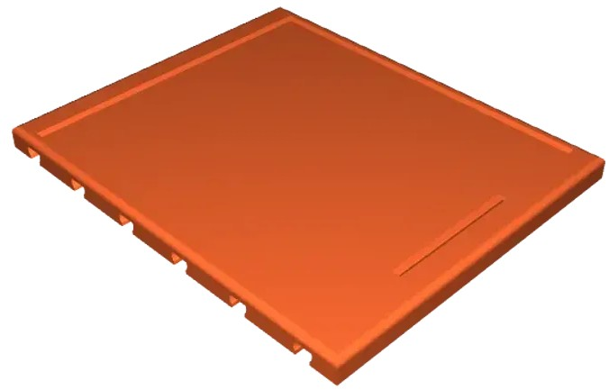

3D-Druckvorlagen für Bauteile, die beim Hochregallager und beim 3-Achs-Roboter verwendet werden.

Das fertige Pad zur Aufnahme der Matrix-Tastatur:

[Die stl-Druckvorlage herunterladen](Keypad_70x78.stl)
