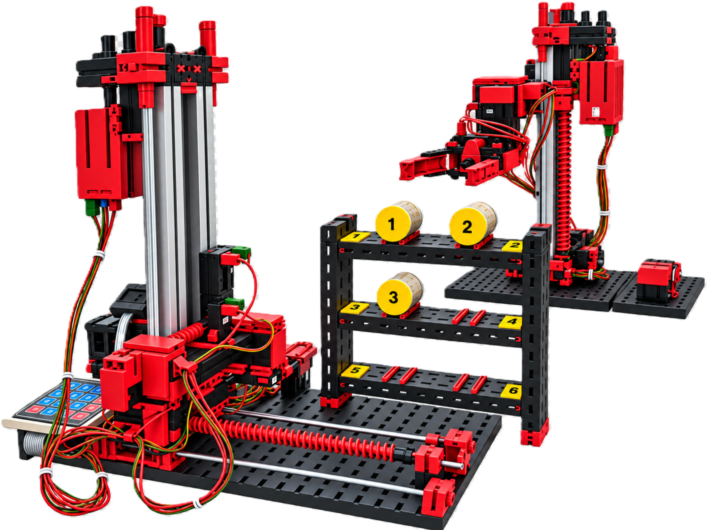

# ft-Hochregallager-und-ft-3-Achs-Roboter
Die beiden Modelle fischertechnik Hochregallager und 3-Achs-Roboter im Kombibetrieb sowie gemeinsame Unterlagen für diese Modelle

## Projektbeschreibung
Die Kombination zeigt zwei Modelle aus dem fischertechnik-Baukasten
„ROBO TX Automation Robots“ als gemeinsame Automatisierungseinheit:

* [3-Achs-Roboter](https://github.com/HR-Projekte/fischertechnik-3-Achs-Roboter-ftDuino)
* [Hochregallager](https://github.com/HR-Projekte/fischertechnik-Hochregallager-ftDuino)
 
#### Funktion:
Das Hochregallager stellt ein ausgelagertes Teil am Umsetzer bereit und meldet dem Roboter über ein Freigabesignal, dass das Teil abgeholt werden kann.

Der 3-Achs-Roboter erkennt dieses Signal, holt das Teil ab und transportiert es zur Ablage.

Umgekehrt kann der Roboter ein Teil am Umsetzer bereitstellen. Das Hochregallager erkennt das dort abgelegte Teil über einen Sensor und lagert es automatisch ein.

## Dokumentation
Die Funktionsschemata zeigen das Zusammenspiel von Hochregallager und 3-Achs-Roboter beim Ein- und Auslagern von Teilen.

[Funktionsschema Einlagern](Dokumentation/Schema-Einlagern.jpg)  
[Funktionsschema Auslagern](Dokumentation/Schema-Auslagern.jpg)

## Video
Eine Vorstellung des Zusammenspiels von Hochregallager und 3-Achs-Roboter ist auf YouTube zu sehen:  
[Video zum ft-Hochregallager-und-ft-3-Achs-Roboter](https://youtu.be/GwqVhUlXc9A)
